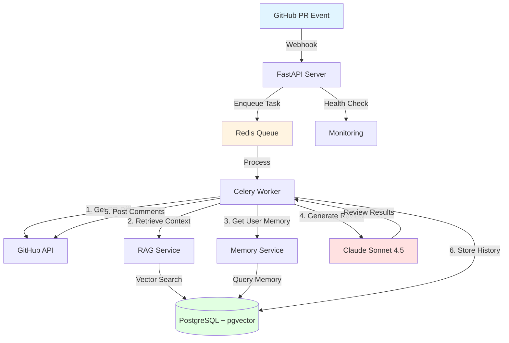
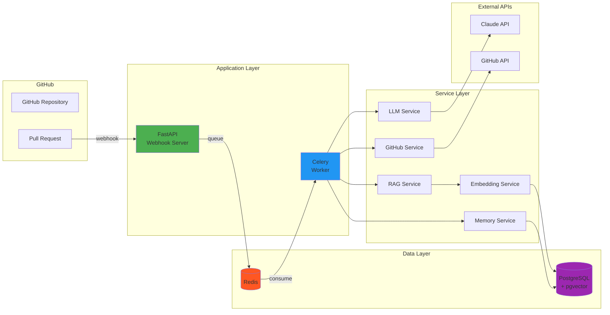
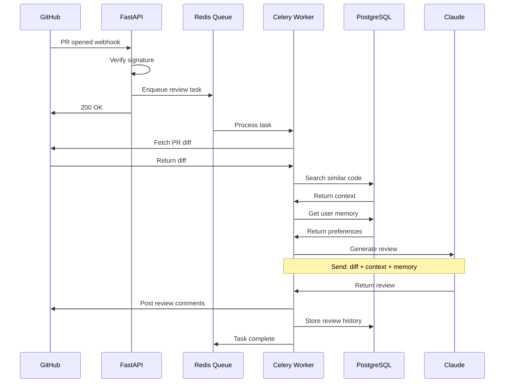
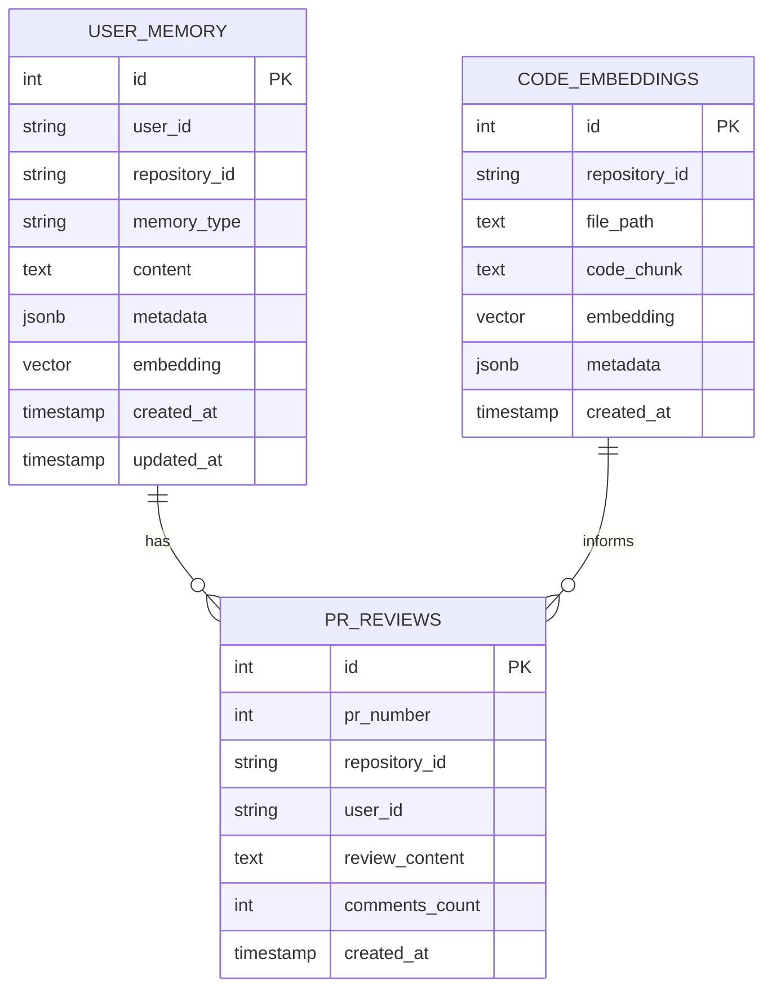
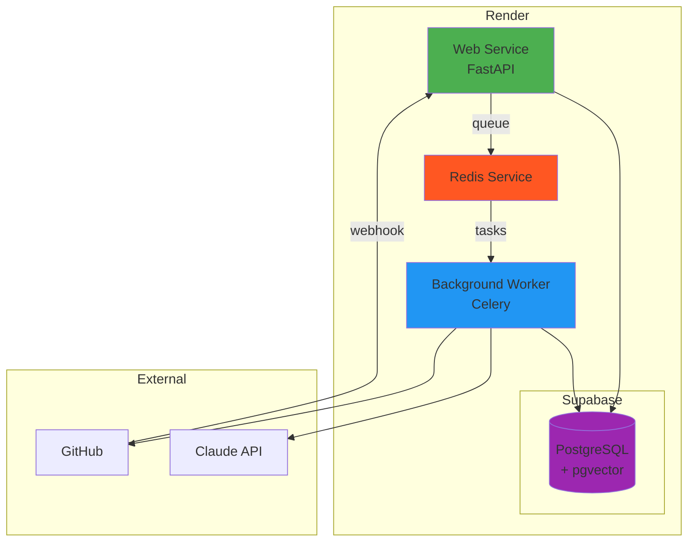
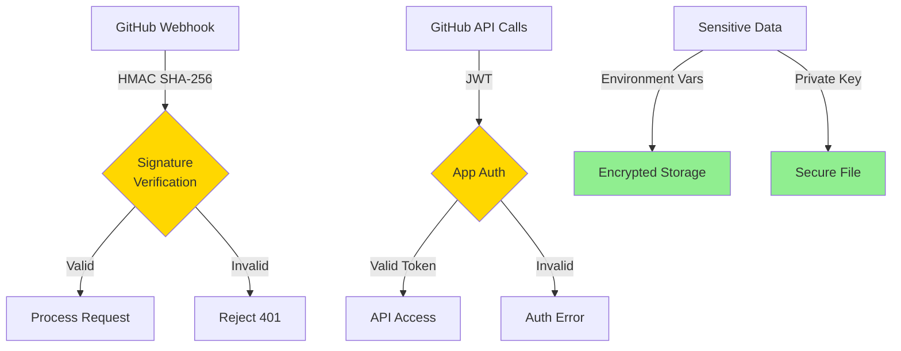

# Architecture Overview

## System Architecture

## Component Diagram

## Data Flow - PR Review Process

## Database Schema

## Deployment Architecture

### Render Deployment

## Key Components

### 1. FastAPI Webhook Server (`app/main.py`)
- Receives GitHub webhook events
- Validates webhook signatures
- Enqueues tasks to Celery
- Provides health check endpoints

### 2. Celery Worker (`app/tasks.py`)
- Processes PR review tasks asynchronously
- Orchestrates review pipeline
- Handles retries on failures
- Manages background indexing

### 3. GitHub Service (`app/github_service.py`)
- GitHub API client wrapper
- Fetches PR diffs and metadata
- Posts review comments
- Manages authentication

### 4. LLM Service (`app/llm_service.py`)
- Claude API integration
- Generates code reviews
- Formats review responses
- Handles API errors

### 5. Memory Service (`app/memory_service.py`)
- User preference storage
- Review history tracking
- Learning from feedback
- Context retrieval

### 6. RAG Service (`app/rag_service.py`)
- Code indexing
- Semantic search
- Context building
- Related file detection

### 7. Embedding Service (`app/embedding_service.py`)
- Vector embedding generation
- Similarity search
- Batch processing
- Model management

### 8. Database Layer (`app/database.py`)
- SQLAlchemy models
- Connection management
- Session handling
- pgvector integration

## Security Architecture

## Performance Considerations

### Scaling Strategies

1. **Horizontal Scaling**
   - Multiple FastAPI instances behind load balancer
   - Multiple Celery workers for parallel processing
   - Redis cluster for high availability

2. **Caching**
   - Cache GitHub API responses
   - Cache LLM responses for similar code
   - Cache embeddings for frequently accessed code

3. **Optimization**
   - Limit file size for reviews
   - Batch embedding generation
   - Index only relevant code files
   - Use connection pooling

### Resource Requirements

| Component | CPU | Memory | Notes |
|-----------|-----|--------|-------|
| FastAPI | 0.5 CPU | 512 MB | Can scale horizontally |
| Celery Worker | 1 CPU | 1 GB | CPU-intensive for embeddings |
| Redis | 0.25 CPU | 256 MB | Memory-based cache |
| PostgreSQL | 0.5 CPU | 1 GB | Storage for vectors |

## Future Enhancements

### Phase 2 (v1.1)
- Multi-model support (OpenAI, Gemini)
- Advanced caching layer
- Analytics dashboard
- Custom review templates

### Phase 3 (v2.0)
- Real-time conversation threads
- Organization-level insights
- Integration with CI/CD
- Custom rules engine
